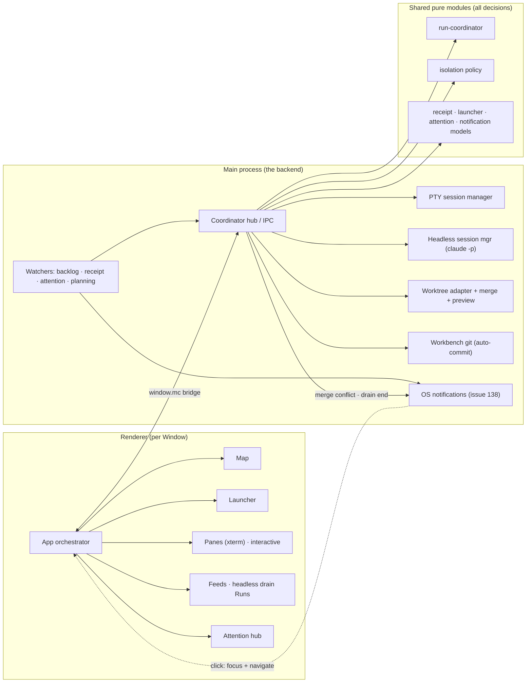
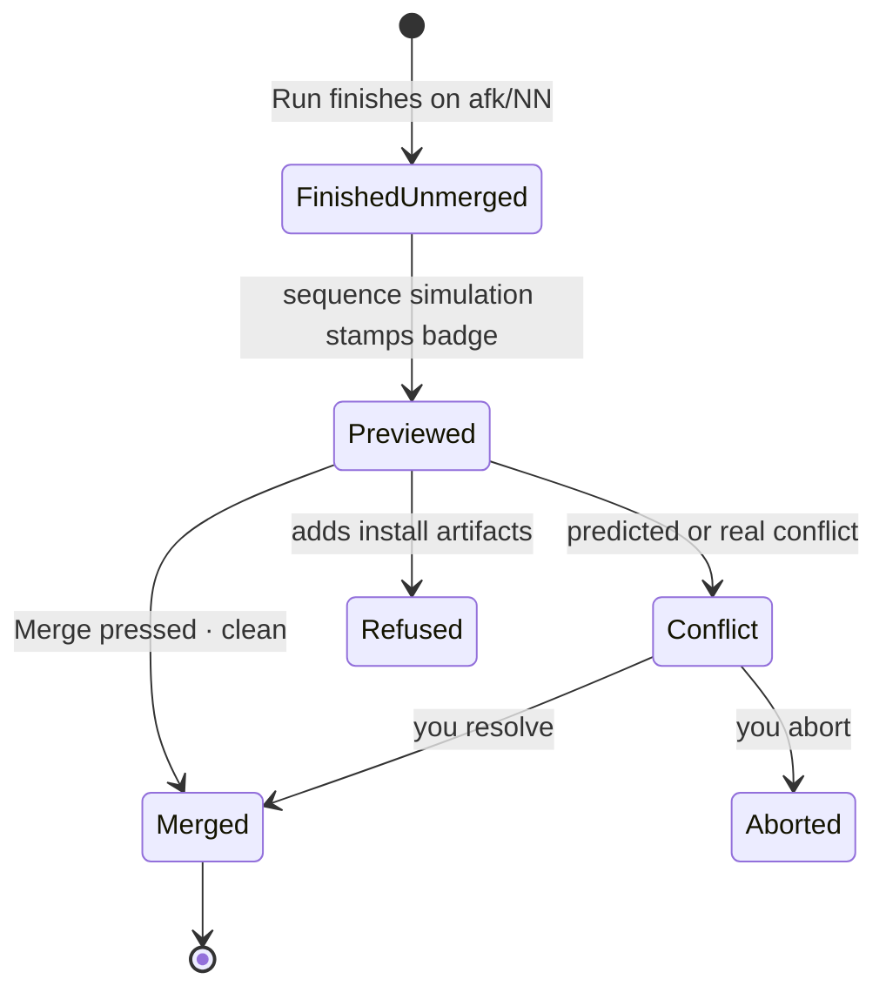
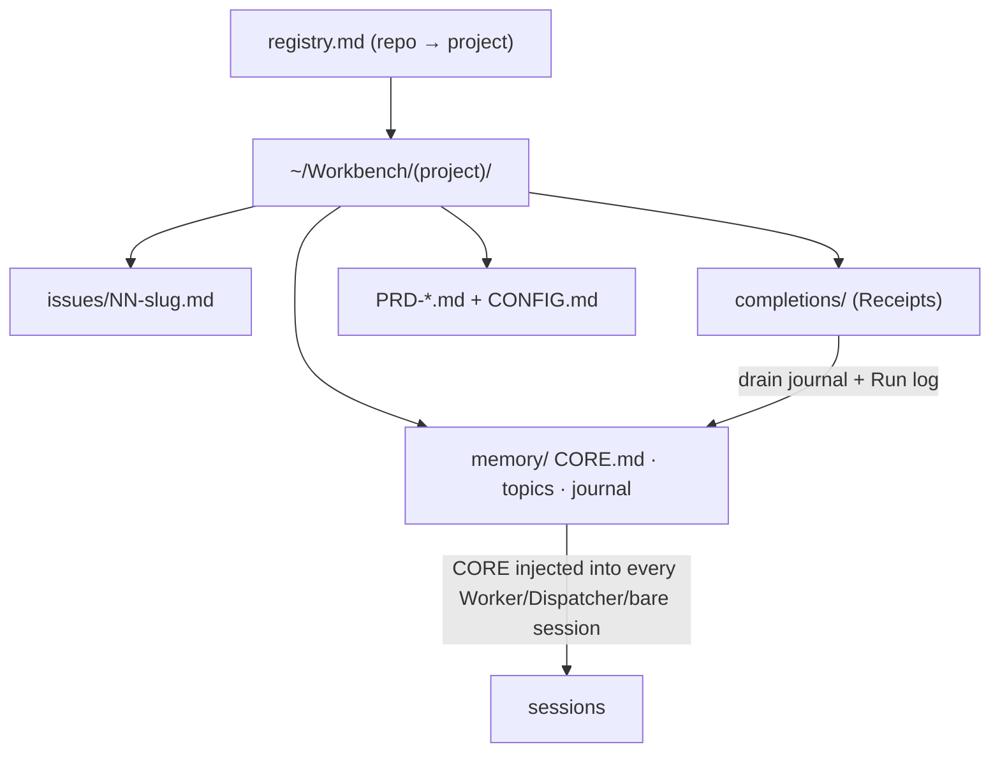

# Architecture — the picture

Four diagrams that stay true. **Doc-drift rule applies here:** a Run whose change
makes one of these wrong updates the diagram in the same Run. Vocabulary is
CONTEXT.md's; decisions live in `docs/adr/`. Diagrams render in Obsidian, GitHub,
and any mermaid viewer.

> **In flight (2026-07-17):** drain-reliability wave (issues 135–138) and the
> headless-lane + merge-as-you-go batch (139–149, ADR-0001 amendment + ADR-0021).
> Where a diagram will change, a note says so.

## 1. System map — one backend, many Windows



Decisions are pure functions in `src/shared/` (each with a sibling test);
`src/main/` is thin adapters; the renderer draws state it is handed.
Heavy files to know: `main/index.ts` (hub), `renderer/App.tsx` (orchestrator),
`main/git-worktree-adapter.ts`, `main/run-merge.ts`.

## 2. A Run's life (drain)

```mermaid
sequenceDiagram
  participant U as You
  participant C as Coordinator
  participant W as Worker session
  participant F as Files (issues/ + completions/)
  participant MC as Watchers → Run log
  U->>C: press Drain (cap N)
  C->>C: planDrain — startable = eligible + deps done
  C->>C: cut + provision worktree (copy node_modules)
  C->>W: spawn headless claude -p --model TIER --effort LEVEL (stream-json, no pty; NODE_ENV=dev)
  W-->>C: stream folded in main → Feed (activity · elapsed · last message · result); session id captured
  W->>F: flip issue open→wip (the claim)
  W->>W: work · verify gate
  W->>F: flip wip→done, write Receipt (before final message)
  F-->>MC: receipt-watcher ingests → Run log card + journal
  MC-->>C: re-plan → next issue fills the slot
```

Results travel **only** through Receipt files (ADR-0013) — the raw stream is
buffered for peek/debug only, never parsed. The **summon moments now fire OS
notifications** (issue 138): an HITL park, a blocked park, a merge conflict, and
the drain stopping/finishing each ping natively so you can walk away; a click
focuses the Window on that Project's attention surface. *Landed (137):* a Run that
reports **blocked** parks — its issue and its dependents wait for you while the
drain keeps scheduling everything else, stopping only when nothing is running and
nothing is eligible; only a Worker that dies with no Receipt still halts
conservatively. *Landed (139):* drain Runs execute **headless** (`claude -p
--output-format stream-json`, no pty), watched via a **Feed** rather than a
terminal, with the session id captured from the stream; a manual single Run keeps
its interactive **Pane**. *Landed (140):* main folds the event stream (pure
`headless-feed` reducer) into Feed **content** — a live activity line, the last
assistant message, and the terminal result (usage kept intact for 143) — pushed on
`RunFeedUpdate`; the renderer consumes snapshots and never parses an event.
*Landed (144):* a live headless Run can be **taken over in a Pane** — kill the
`claude -p` child, then `claude --resume <session-id>` interactively in the same
cwd — with the Run keeping its drain slot, generation, and issue guard across the
switch (the coordinator sees the same running Run, so it schedules around it
unchanged); a **finished** Run resumes the same way post-mortem for interrogation,
creating no new Run and touching no backlog. *Landed (154):* drain Workers spawn
on a **declared, cheap-by-default model** — CONFIG `worker_model` (default
`sonnet`) with an optional per-issue `model:` override — passed as `--model <id>`;
a failed attempt escalates one tier up from a fresh worktree (capped at
`escalation_ceiling`, default `opus`, and 3 attempts). Drain Runs only —
interactive entry points keep the interactive default model. *Landed (155):* each
drain Worker also carries a declared **effort** (`--effort <level>`), **derived
from the tier** by default (`haiku`→low, `sonnet`→medium, `opus`/`fable`→high)
with an issue `effort:` / CONFIG `worker_effort` override — a second cost lever
beside the model; escalation re-derives it for the bigger tier unless a per-issue
`effort:` pins it. *Landed (141):* a hung headless Run is **killed at
`run_timeout`** (CONFIG frontmatter, minutes, default 30) — the Headless
Session Manager arms a real kill timer at spawn; breach kills the child, and
the exit (like any headless exit non-zero with no Receipt) lands in the SAME
no-Receipt handling (conservative drain stop, a missing-Receipt note), naming
the cause ("timeout" vs. "crashed") — no new failure vocabulary. A Receipt
that lands before death still wins. *Queued:* Run telemetry —
tokens/cost/duration (143).

## 3. Merge lifecycle



Today the press is yours and order is ascending issue id. *Queued (ADR-0021,
145–148):* an always-on **auto-merge lane** merges clean Receipt-backed branches
in **finish order** with no press; a conflict pauses the lane and pings you;
solo-chaining retires — an issue starts only when its deps are done **and
integrated** ("waiting on merge of NN" otherwise).

## 4. Data layer — the Workbench (ADR-0015)



One private git repo holds every project's pipeline artifacts; MC auto-commits
per Run event; Obsidian is a lens, never a dependency. Code-describing docs
(CONTEXT.md, ADRs, this file) stay with the code.
